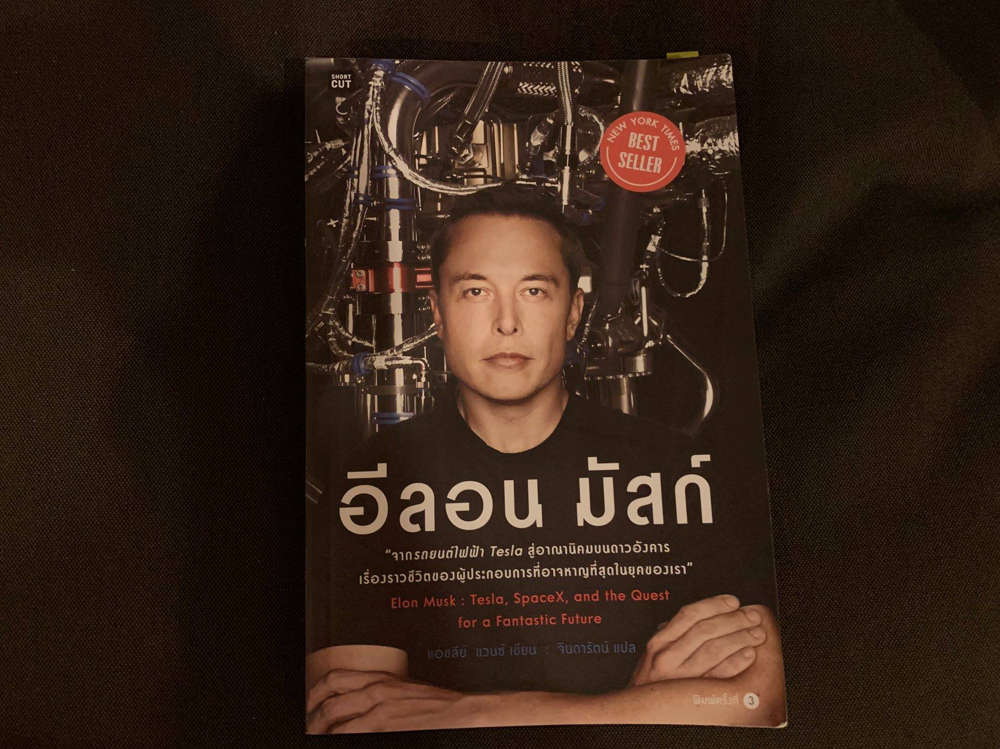

>"ตอนที่หนังสือเล่มนี้ถึงมือคุณ เป็นไปได้มากว่ามัสก์กับสเปซเอกซ์ จะร่อนจรวดลงจอดบนเรือบรรทุกลางทะเล หรือกลับมาที่แท่นปล่อยในฟลอริดาได้แล้ว"

เป็นประโยคท้ายๆของหนังสือเล่มนี้ซึ่งทั้งสองอย่างที่ว่ามันก็สำเร็จจริงๆในปี 2015 กับปี 2016

อ่านเล่มนี้จบให้ความรู้สึกคล้ายๆกับตอนที่อ่านหนังสือประวัติของสตีฟจ็อบจบ แต่ด้วยความรู้สึกว่าไม่อยากที่จะให้เป็นแบบสตีฟจ็อบอีกแล้ว นั่นคือจ็อบตายไปแล้วเราเพิ่งจะได้มาอ่านประวัติเขา

สำหรับอีลอน มัสก์ก็เลยตั้งใจว่าถ้ามีโอกาศก็อยากจะรีบอ่านประวัติของแกให้ได้ ซึ่งก็มีหลายๆส่วนจริงๆที่มัสก์ก็คล้ายๆกับจ็อบ    

ไม่แน่ก็ได้ว่าคนที่จะทำอะไรสำเร็จขนาดนี้อย่างน้อยก็ต้องบ้ากว่าคนธรรมดาอยู่บ้างล่ะ หรืออาจต้องผสมส่วนร้ายๆที่บางคนอาจจะไม่ชอบเข้าไปด้วยบ้างล่ะ

บางคนก็เหมือนยังไม่เชื่อเท่าไหร่ว่าสิ่งที่อีลอนโม้ไว้จะทำได้จริงๆ ทั้งเรื่อง Tesla หรือ SpaceX แต่มันก็สนุกตรงนี้ที่ว่า อย่างน้อยเราก็ยังได้ติดตามข่าวคราวของทั้งสองบริษัทอย่างต่อเนื่อง 

อ่านเล่มนี้เข้าไปก็เหมือนทำให้ยิ่งอินเข้าไปอีกว่าในอนาคตที่จะถึงนี้จะมีอะไรเกิดขึ้นมาบ้างนะ โลกอนาคตมันจะหน้าตาเป็นยังไงกันนะ

ถ้าให้เทียบจริงๆพระเอกของเล่มนี้คงเป็น SpaceX มากกว่า Tesla รู้สึกอินจริงๆกับความพยายามของมนุษย์ที่จะปล่อยจรวดขึ้นไป เอาชนะแรงโน้มถ่วงของโลก หรือแม้แต่สิ่งที่คนหลายๆคนบอกว่าไม่มีทางทำได้ แต่มัสก์ก็บ้าพอที่จะพูดว่า มันจะเป็นไปได้ในช่วงชีวิตของเรานี่แหละ

พอได้เห็นสิ่งที่เขาพูดค่อยๆเป็นจริงๆที่ละอย่างๆ (แม้จะช้ากว่ากรอบเวลาที่แกเคยบอกไปเยอะ) มันก็ทำให้รู้สึกว่ามันเป็นอะไรที่โคตรเท่เลยนะ ที่คนเราจะตั้งเป้าหมายที่เหมือนจะเป็นไปไม่ได้เอาไว้ แล้วค่อยๆไล่ตามสิ่งนั้นไปที่ละก้าวๆแบบนี้ 

อ่านจบแล้วก็รู้สึกมีไฟที่จะทำงานขึ้นมานิดหน่อยนะ ถึงแม้การเขียนแอพมันจะไม่ได้ยิ่งใหญ่เหมือนการปล่อยจรวดก็เถอะนะ