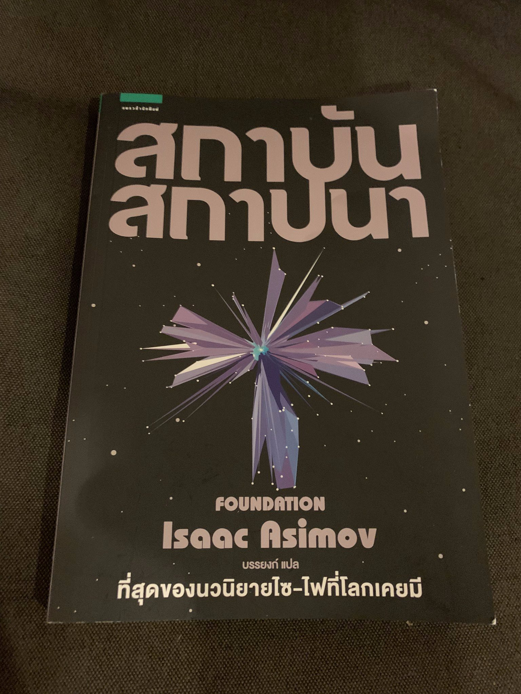

### สถาบันสถาปนา - Isaac Asimov

จากที่ซื้อมามีทั้งหมด 3 เล่ม เพิ่งอ่านเล่มแรกจบ ก็เลยเขียนถึง
จริงๆเคยได้ยินชื่อหนังสือนี้นานแล้ว แต่ก็เพิ่งจะมีพิมพ์ออกมาใหม่เป็น box set สวยงามทีเดียว

ตอนแรกคิดว่าจะเป็นนิยายวิทยาศาสตร์แฟนตาซี หรือดราม่า แบบที่เคยๆอ่านมา
ที่ไหนได้นี่มันหนังสือ การเมือง ปรัชญาและการวางแผนชัดๆ

หนังสือเล่าถึงโลกอนาคตที่ไกลมากๆ มนุษย์อยู่ตามดวงดาวต่างๆ
และก็มีนักคณิตศาสตร์คนนึงที่คิดค้นวิชาที่ชื่อ อนาคตประวัติศาสตร์ ซึ่งสามารถใช้คณิตศาสตร์ เพื่อทำนายอนาคตได้อย่างแม่นยำ
คำทำนายแรกๆเลยนั่นก็คือ การที่มนุษย์ต้องสร้างอนานิคมใหม่ขึ้นมา ชื่อ สถาบันสถาปนา เพื่อที่จะเป็นอาณาจักรที่รุ่งเรืองในอนาคต
สิ่งที่ชอบมากๆของเล่มนี้คือ การนำเอาสามประเด็นมาร้อยเรียงต่อกันได้อย่างน่าสนใจ นั่นคือ
การทูต ศาสนา และการค้า สามสิ่งที่สามารถใช้เป็นอาวุทเพื่อที่จะทำให้บรรลุเป้าหมายที่สถาบันสถาปนาต้องการ

อ่านเล่มนี้จบแล้วทำให้นึกถึงสิ่งที่ CEO ของอโกด้าพูดเอาไว้เมื่อ Town hall ครั้งล่าสุดเลย
ที่บอกว่า เราไม่สามารถทำสิ่งเดิมๆ แล้วมันจะให้ผลลัพธ์เหมือนเดิมได้ตลอดไปหรอก
มันอาจจะให้ผลที่ดีในช่วงแรก แต่เมื่อเวลาผ่านไปมันจะไม่เวิร์ค (หรือไม่เวิร์คเหมือนเดิม)
ยังเหลืออีกสองเล่มที่รอให้อ่าน แต่คิดว่าคงจะพักไว้ก่อน จัดการเล่มอื่นที่อ่านค้างอยู่ให้จบก่อน

สิ่งที่ไม่ชอบเลยของหนังสือชุดนี้คือ การแปลที่โคตรจะใช้ภาษาที่โบราณ แบบทำให้นึกถึงคำที่ใช้ในละครบุพเพสันนิวาสเลยอ่ะ มันก็ให้อารมณ์อีกแบบนะ แต่ถึงอย่างนั้นก็รู้สึกว่ามันขัดความรู้สึกเกินไปหน่อย

