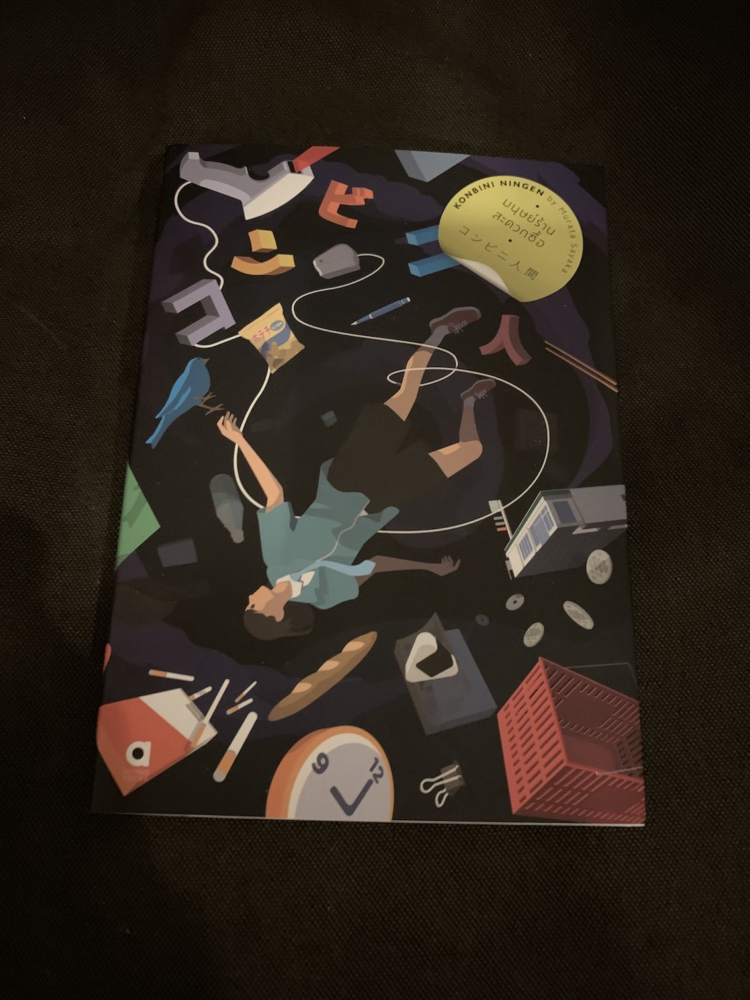

#### มนุษย์ร้านสะดวกซื้อ

เป็นนิยายที่เล่มไม่หนาเลย แต่อ่านจบแล้วทำให้เราตั้งคำถามเยอะมาก ทั้งเรื่องของความเป็นปัจเจก หรือเรื่องของการงาน

ทำให้เราได้คิดและก็รู้สึกชัดขึ้นว่าสังคมรอบตัวเราชอบตัดสินคนอื่นกันมากแค่ไหน ทั้งโดยที่เราต่างรู้ตัวหรือไม่รู้ตัว ความต่างจากสังคมแค่เพียงนิดเดียวก็อาจทำให้เราถูกขับไล่ออกจากคนส่วนมากได้ง่ายๆ

หรือว่ามันคือสิ่งที่ถูกฝังมาในยีนส์ของเรากันนะ หรือว่าเรื่องพวกนี้ไม่ใช่ความแปลกประหลาดอะไรเลย

อีกเรื่องที่น่าสนใจจากเล่มนี้คือเรื่องของการงาน กับคำถามที่ว่าเราถ้าเราลบสิ่งที่เรียกว่าอาชีพออกไปจากตัวเราแล้ว เรายังเป็นเราอยู่หรือเปล่า  หรือเอาจริงๆมนุษย์เราก็ขอแค่มีสิ่งยึดเหนี่ยวไว้เพื่อไม่ให้ถูกเหวียงหลุดออกไปจากความคาดหวังของสังคมและคนรอบข้าง

รวมๆก็สนุกดี และสั้นมากๆอ่านคืนเดียวก็จบได้เลย ถือว่าเป็นเล่มที่โอเคในการอ่านแก้เลี่ยนจากพวกหนังสือหนักๆ

