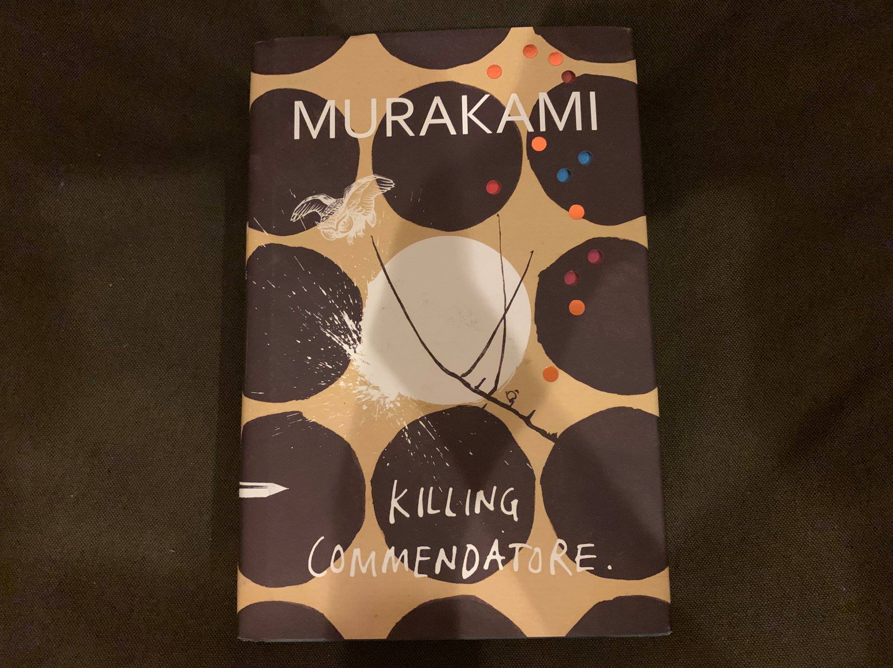

>“Time steals some things, but it gives us back others. Making time our ally is an important part of our work”

เล่มแรกของปีนี้ ปีนี้มีความตั้งใจว่าจะพยายามเขียนถึงหนังสือที่อ่านจบทุกเล่มให้ได้ อย่างน้อยจะได้เขียนอะไรออกมาบ้างหลังจากที่ไม่ได้เขียนอะไรเลยมาพักใหญ่ๆแล้ว
 

Killing Commendatore  เล่มนี้น่าจะเป็นนิยายเล่มล่าสุดของมุราคามิ แต่ว่ายังไม่มีสัมนักพิมพ์ไหนแปลสักที ก็เลยอาจหาญอ่านเวอร์ชั่นภาษาอังกฤษไปเลยละกัน ก็ถือว่ายังโชคดี่ที่เข็นให้อ่านจนจบได้ รู้สึกมีความต่างนิดหน่อยเวลาอ่านที่เป็นเวอร์ชั่นภาษาอังกฤษ ส่วนตัวรู้สึกชอบสำนวนของมุราคิที่แปลออกมาเป็นภาษาไทยแล้วมากกว่า ไม่แน่ใจเหมือนกันว่าทำไม

หลังจากที่อ่านงานเขียนของมุราคามิมาเป็นเวลานานเหมือนกัน เลยรู้สึกว่าเล่มนี้เฮียแกพยายามจะใส่อะไรหลายๆอย่างลงมาทำให้นึกถึงเรื่องก่อนๆพอสมควร แต่ที่ชัดๆเลยแทบจะเรียนกว่าบูชาครูคงจะได้คงเป็นพล็อทที่ถอดออกมาจาก The Great Gatsby ของ F. Scott Fitzgerald อ่านๆไปยังคิดเลยว่า เฮียเอางี้เลยหรอ

แต่สุดท้ายก็ไม่พ้นสไตล์มุราคามิ ทุกอย่างถูกตีกลับมาในโลกที่คล้ายๆเดิมที่เป็นแบบฉบับของมุราคามิก็ว่าได้ โลกที่แม่งโคตรเหงา โคตรเจ็บปวด การถูกนอกใจ และการนอนกับเมียชาวบ้าน (ฮาๆ)  และโลกที่แสนประหลาด (เช่นมนุษย์ที่หลุดออกมาจากรูปวาด?) ถึงตัวละครจะทำนิ่งครึมจนคิดว่าถ้าเป็นคนแบบนี้ได้บ้างก็คงดี แต่ไม่เป็นจะดีกว่า เพราะเชื่อเหลือเกินว่าความปวดร้าวของตัวละครพวกนั้นมันต้องกัดกินความรู้สึกภายในจนแทบจะทนไม่ไหวแล้วแน่ๆ

สรุปเนื้อหาโดยรวมเล่มนี้คงพยายามที่จะพูดถึงเรื่องราว ความจริงหรือประวัติศาสตร์บางอย่าง ที่อาจจะดีกว่าที่จะปล่อยให้มันเป็นเช่นนั้น อยู่ในหลุมลึกที่ไม่มีใครควรจะต้องหยิบยกมันขึ้นมาเพื่อหาความหมายใดๆอีก บางครั้งบางที การอยู่กับปัจจุบัน โดยลืมคำถามบางคำถามไปนั่นอาจจะเป็นหนทางที่มนุษย์เราจะสามารถใช้ชีวิตต่อไปได้อย่างปกติสุขก็ได้ (อย่าได้ไว้ใจใครก็ตามที่บอกว่าตัวเองเป็นคนปกติทั่วไปเด็ดขาด มุราคามิบอก) 

ไม่แน่เหมือนกันว่าจากเรื่องราวที่ถูกร้อยเรียงเป็นนิยายหนาเกือบ 700 หน้าเล่มนี้อาจต้องการแค่ถ่ายเรื่องราว และความรู้สึกที่มุราคามิมีต่อเหตุการณ์การสังหารหมู่นานกิงในสมัยสงครามโลกครั้งที่สองก็ได้

ทุกครั้งเลยเหมือนกันหลังจากที่อ่านนิยายของมุราคามิจบก็คือความรู้สึกโล่งใจที่อ่านจนจบเสียที บวกกับเกร็ดความคิดบางอย่างที่คล้ายๆว่าจะจับต้องไม่ได้ แต่พอเอามาคิดต่อให้ดีดีแล้วก็พบว่าเป็นเรื่องที่ไม่ยากนักเท่าไหร่ที่จะทำความเข้าใจ (ทำให้สงสัยว่าจะเขียนยืดยาวทำไม =..=)  แต่ก็คงเป็นเสน่ หรือเอกลักษณ์ของเขาเองล่ะมั้ง

>“Curiosity always involves risk. You can’t satisfy your curiosity without  accepting some risk. Curiosity didn’t just kill the cat”

>“There are plenty of things in history that are best left in the shadows. Accurate knowledge does not improve people’s lives.”

>“Pain was a metaphor”